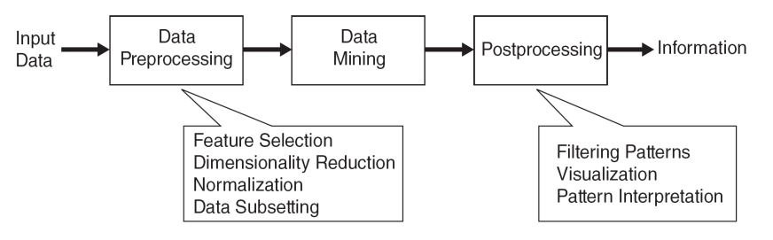
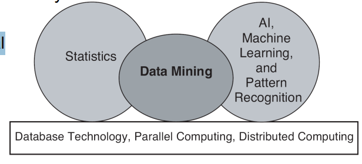
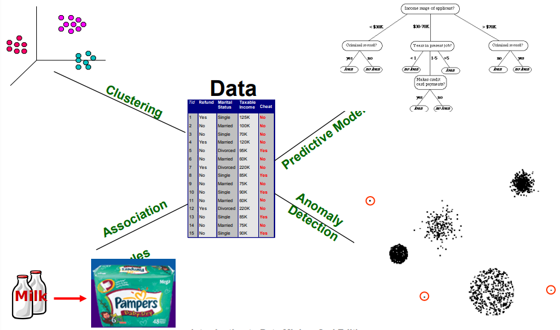
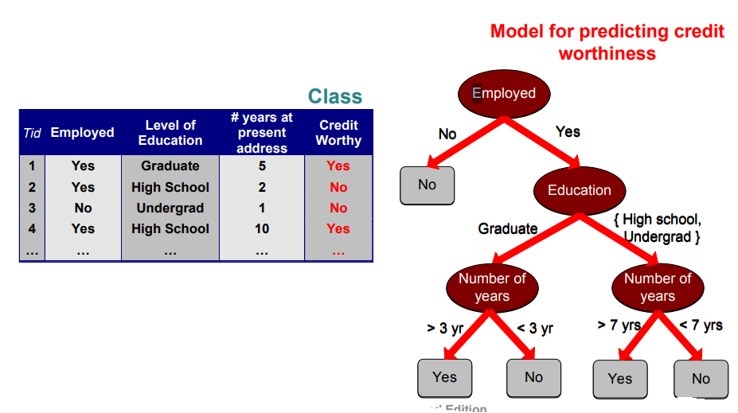
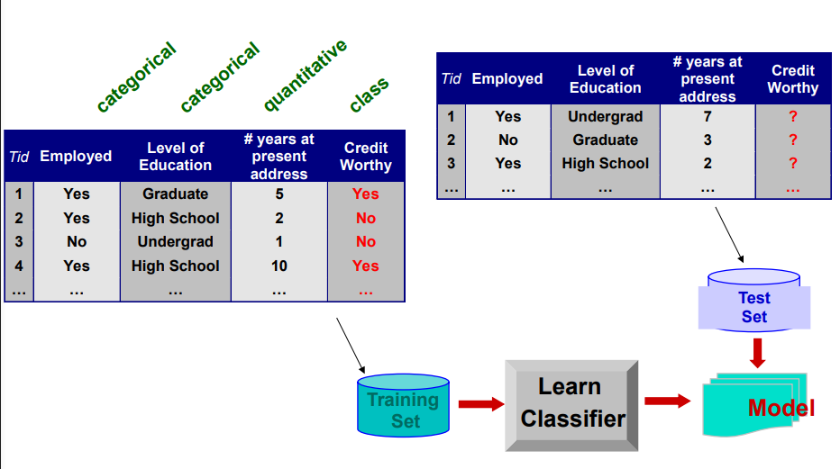
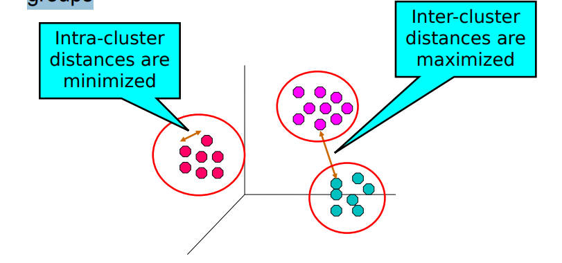
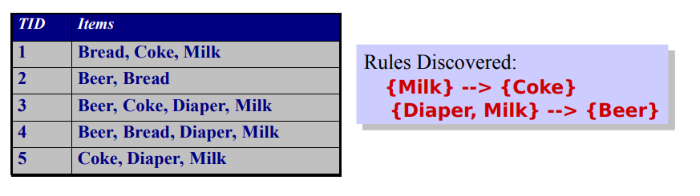
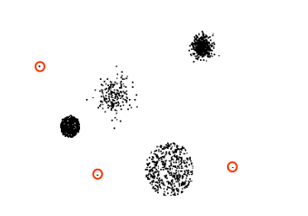

# Apontamentos relevantes aos slides de Introduction to Data Science

## Why Data Mining? Scientific Viewpoint 

* Data mining ajuda ciêntistas
    * em anâlise automática de grandes datasets
    * Formação de hipoteses


## What is Data Mining?

* Varias definições
    * Extração não trivial de informações implícitas, previamente desconhecidas e potencialmente úteis de dados

    * Exploração e análise, por meios automáticos ou semiautomáticos, de grandes quantidades de dados, a fim de descobrir padrões significativos



## Origins of Data Mining

* Extrai ideias de aprendizagem máquina/IA, reconhecimento de padrões, estatística e sistemas de base de dados

* As técnicas tradicionais podem ser inadequadas devido aos dados que são
    * Grande escala
    * Alta dimensão
    * Heterogêneo
    * Complexo
    * Distribuído




## Data Mining Tasks

* Métodos de Predição
    * Use algumas variáveis ​​para prever valores desconhecidos ou futuros de outras variáveis.
* Métodos de Descrição
    * Encontre padrões interpretáveis ​​por humanos que
descrevam os dados.


```bash
    input é uma tabela 
        -> Caa linha é chamada de : Objeto, Observações, Sujeito, ...

        -> Cada coluna é chamada de: Feature, Atributo, Variável

        -> Em ML temos associado Target Variable (tipicamente é a ultima coluna da tabela)
```


## Data Mining Tasks …



 * Clustering 
    * Queremos saber se existem grupos nos dados
    * Output:  Vetor para cada cluster que geramos, no e.g. temos 3 clusters
    * É interpretável (desde de que representamos o output)

* Association Rules 
    * Também serve para verificar a existência de grupos
    * Output: são regras (e.g. todo o individuo que compra leite compra pampers)
    * É intrepertável

* Predictive Model 
    * e.g. Decision Tree
    * É intrepetável 

* Anomaly Detection
    * Aqui focamos em acontecimentos raros
    * Pode ser intrepertavel (depende do modelo utilizado)
    * Podemos usar diferentes modelos para focar nestes casos raros 

## Predictive Modeling: Classification


* Encontre um modelo para o atributo de classe como uma função dos valores de outros atributos

```bash 
    No exemplo acima, utilizamos uma Decision Tree (Predective Model) que preve se alguém tem direito e crédito 

    Na DT a feature + importante é 'Employed', a segunda mais importante é 'Education', ...

```

## Classification Example



> Nota: nunca devemos usar o **test Set** na fase de training. Para avaliar o modelo devemos usar um test set diferente do training set


## Examples of Classification Task

* Classificar transações com cartão de crédito
como legítimas ou fraudulentas
* Classificar coberturas de solo (corpos d'água, áreas urbanas,
florestas, etc.) usando dados de satélite
* Categorizar notícias como finanças,
clima, entretenimento, esportes, etc.
* Identificar intrusos no ciberespaço
* Prever células tumorais como benignas ou malignas
* Classificar estruturas secundárias de proteínas
como alfa-hélice, folha beta ou espiral aleatória

## Classification: Application 1

* Deteção de Fraude
    * Objetivo: Prever  casos fraudulentos em transações de cartão de crédito.

    * Aproximação: 
        * Usa transações de cartão de crédito e as informações sobre o titular da conta como atributos.
            * Quando é que um cliente compra, o que é que ele compra, com que frequência ele paga a tempo, etc.
        * Rotula transações passadas como fraude ou transações válidas. Isso forma o atributo de classe.
        * Aprender um modelo para a classe das transações.
        * Usar este modelo para detectar fraudes observando transações de cartão de crédito em uma conta.

> Nota: o melhor curso é falar com domain expert e perguntar qual são as features

## Classification: Aplication 2
* Previsão de rotatividade para clientes de telefonia
    * Objetivo: Prever a probabilidade de um cliente ser perdido para um concorrente.
    * Abordagem:
        * Utilizar o registro detalhado das transações com cada um dos clientes anteriores e atuais para encontrar atributos.
            * Com que frequência o cliente liga, para onde ele liga, a que horas do dia ele liga mais, sua situação financeira, estado civil, etc.
    * Rotular os clientes como leais ou desleais.
    * Encontrar um modelo para lealdade.

## Classification: Application 3
* Catalogação de Levantamentos Celestes
    * Objetivo: Prever a classe (estrela ou galáxia) de objetos celestes, especialmente os visualmente tênues, com base nas imagens de levantamento telescópico (do Observatório Palomar).
        * 3000 imagens com 23.040 x 23.040 pixels por imagem.
    * Abordagem:
        * Segmentar a imagem.
        * Medir os atributos da imagem (características) - 40 deles por objeto.
        * Modelar a classe com base nessas características.
        * História de Sucesso: Conseguiu encontrar 16 novos quasares de alto desvio para o vermelho, alguns dos objetos mais distantes e difíceis de
encontrar!


## Regression 

* Prever o valor de uma determinada variável de valor contínuo com base nos valores de outras variáveis, assumindo um modelo linear ou não linear de dependência.
* Amplamente estudado em estatística e áreas de redes neurais.
* Exemplos:
    * Previsão do volume de vendas de um novo produto com base em gastos com publicidade.
    * Previsão da velocidade do vento em função de
temperatura, umidade, pressão atmosférica, etc.
    * Previsão de séries temporais de índices do mercado de ações.


## Clustering

* Encontrar grupos de objetos de forma que os objetos em um
grupo sejam semelhantes (ou relacionados) entre si e
diferentes (ou não relacionados) aos objetos em outros
grupos



## Applications of Cluster Analysis

* Compreensão
    * Criação de perfil personalizado para marketing direcionado
    * Agrupamento de documentos relacionados para navegação
    * Agrupamento de genes e proteínas que possuem funcionalidade semelhante
    * Agrupamento de ações com flutuações de preço semelhantes
* Sumarização
    * Redução do tamanho de grandes conjuntos de dados

## Clustering: Application 1
* Segmentação de Mercado:
    * Objetivo: subdividir um mercado em subconjuntos distintos de clientes, onde qualquer subconjunto pode ser selecionado como um mercado-alvo a ser alcançado com um mix de marketing distinto.
    * Abordagem:
        * Coletar diferentes atributos dos clientes com base em suas informações geográficas e relacionadas ao estilo de vida.
        * Encontrar grupos de clientes semelhantes.
        * Medir a qualidade do agrupamento observando os padrões de compra dos clientes no mesmo grupo em comparação com aqueles de grupos diferentes.

## Clustering: Application 2
* Agrupamento de Documentos:
    * Objetivo: Encontrar grupos de documentos semelhantes entre si com base nos termos importantes que aparecem neles.
    * Abordagem: Identificar termos que ocorrem com frequência em cada documento. Formar uma medida de similaridade com base nas frequências de diferentes termos. Use-a para agrupar.

## Association Rule Discovery: Definition
* Dado um conjunto de registros, cada um contendo
algum número de itens de uma determinada coleção
    * Produzir regras de dependência que irão prever a ocorrência de um item com base nas ocorrências de outros itens.



## Association Analysis: Applications

* Análise de cesta de compras
    * Regras são usadas para promoção de vendas, gestão de prateleiras e gestão de estoque
* Diagnóstico de alarmes de telecomunicações
    * Regras são usadas para encontrar combinações de alarmes que ocorrem juntos com frequência no mesmo período
* Informática Médica
    * Regras são usadas para encontrar combinações de sintomas de pacientes e resultados de testes associados a certas doenças

## Deviation/Anomaly/Change Detection

* Detectar desvios significativos do
comportamento normal
* Aplicações:
    * Detecção de fraudes em cartões de crédito
    * Detecção de intrusão de rede
    * Identificar comportamento anômalo de redes de sensores para monitoramento e vigilância.
    * Detectar mudanças na cobertura florestal global.

