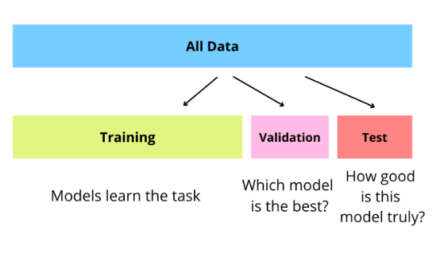

# 🚀 Apontamentos: Introdução à Data Science

---

## 🔬 O que é Data Mining?

### Visão Científica

O Data Mining (Mineração de Dados) é crucial para cientistas, pois auxilia:

* Na **análise automática** de grandes *datasets*.
* Na **formação de hipóteses** baseadas em padrões.

### Definições Chave

O Data Mining possui várias definições que convergem:

1.  **Extração não trivial** de informações **implícitas**, previamente desconhecidas e potencialmente úteis a partir dos dados.
2.  **Exploração e análise**, por meios automáticos ou semiautomáticos, de grandes volumes de dados, com o objetivo de **descobrir padrões significativos**.

---

## ⏳ Origens e Desafios do Data Mining

O Data Mining extrai conceitos de diversas áreas:

* **Aprendizagem Máquina / IA**
* **Reconhecimento de Padrões**
* **Estatística**
* **Sistemas de Base de Dados**

### Por que as Técnicas Tradicionais são Inadequadas?

As técnicas tradicionais falham perante dados que são:

* **Grande escala** (Volume)
* **Alta dimensão** (Variedade)
* **Heterogêneos** e **Complexos**
* **Distribuídos**

---

## 🛠️ Tarefas de Data Mining

As tarefas de Data Mining dividem-se em dois métodos principais:

### 1. Métodos de Predição
Usam algumas variáveis para **prever valores desconhecidos** ou futuros de outras variáveis.

### 2. Métodos de Descrição
Encontram **padrões interpretáveis** por humanos que descrevam os dados.

### Nomenclatura Comum

Numa tabela de dados:

| Elemento | Nome Comum em Data Science / ML |
| :--- | :--- |
| Cada linha | Objeto, Observação, Sujeito, Instância |
| Cada coluna | **Feature** (Característica), **Atributo**, Variável |
| Última coluna | **Target Variable** (Variável Alvo) |

### Exemplos de Tarefas (Descritivas e Preditivas)

| Tarefa | Tipo | Objetivo / Output | Interpretável? |
| :--- | :--- | :--- | :--- |
| **Clustering** | Descritiva | Encontrar grupos (clusters) nos dados. Output: vetor para cada cluster. | Sim (mediante representação) |
| **Association Rules** | Descritiva | Verificar relações entre itens. Output: regras (*e.g.* "Se compra leite, compra pampers"). | Sim |
| **Predictive Model** | Preditiva | Gerar um modelo para fazer previsões (*e.g.* Decision Tree). | Geralmente Sim |
| **Anomaly Detection** | Descritiva/Preditiva | Focar em acontecimentos raros (desvios). | Depende do modelo |

---

## 🎯 Modelagem Preditiva

### Classification (Classificação)

* Encontrar um modelo para o **atributo de classe** (variável alvo) em função dos valores dos outros atributos.

* **Exemplo:** A *Decision Tree* acima prevê o crédito. A *Feature* mais importante é 'Employed', seguida por 'Education'.

#### Regra de Ouro
> Nunca se deve usar o **Test Set** na fase de *training*. Para avaliar o modelo, deve-se usar um *test set* diferente do *training set*.

#### Training Set vs Validation Set vs Test Set

* Em **Machine learning** existem três datasets. Na imagem seguinte podemos ver cada um deles e o que são 

#### Exemplos de Aplicações de Classification
* Detetar **fraude** em transações de cartão de crédito (legítimas vs. fraudulentas).
* Categorizar **notícias** (finanças, clima, desporto, etc.).
* Prever células tumorais como **benignas ou malignas**.
* Prever a **rotatividade** (*churn*) de clientes de telefonia (leais vs. desleais).
* Catalogar levantamentos celestes (estrela vs. galáxia).

> **Nota:** O melhor curso de ação é sempre consultar o **domain expert** para identificar as *features* mais relevantes.

---

### Regression (Regressão)

* Prever o valor de uma variável de **valor contínuo** (não discreto) com base noutras variáveis.
* Assume um modelo de dependência linear ou não linear.
* **Exemplos:**
    * Previsão do **volume de vendas** de um novo produto.
    * Previsão da **velocidade do vento** (em função de temperatura, umidade, etc.).
    * Previsão de **séries temporais** de índices do mercado de ações.

---

## 🧩 Clustering (Agrupamento)

* Encontrar grupos de objetos onde os objetos num grupo são **semelhantes** entre si e **diferentes** dos objetos noutros grupos.

### Aplicações de Cluster Analysis
* **Compreensão:** Criação de perfil personalizado para **marketing direcionado**.
* **Sumarização:** Redução do tamanho de grandes conjuntos de dados.
* **Segmentação de Mercado:** Subdividir clientes em subconjuntos distintos baseados em atributos geográficos e de estilo de vida.
* **Agrupamento de Documentos:** Encontrar documentos semelhantes com base nos termos importantes que aparecem neles.

---

## 🔗 Association Rule Discovery (Descoberta de Regras de Associação)

### Definição
* Dado um conjunto de registos, produzir **regras de dependência** que preveem a ocorrência de um item com base nas ocorrências de outros itens.

### Aplicações
* **Análise de Cesta de Compras:** Usadas para promoção de vendas, gestão de prateleiras e gestão de estoque.
* **Diagnóstico de Alarmes:** Encontrar combinações de alarmes que ocorrem frequentemente juntos (*e.g.* em telecomunicações).

---

## 🚨 Deviation/Anomaly/Change Detection

* **Objetivo:** Detetar **desvios significativos** do comportamento normal.
* Foco em **acontecimentos raros**.

### Aplicações
* **Detecção de fraudes** em cartões de crédito.
* **Detecção de intrusão** de rede.
* Identificar **comportamento anómalo** de redes de sensores.