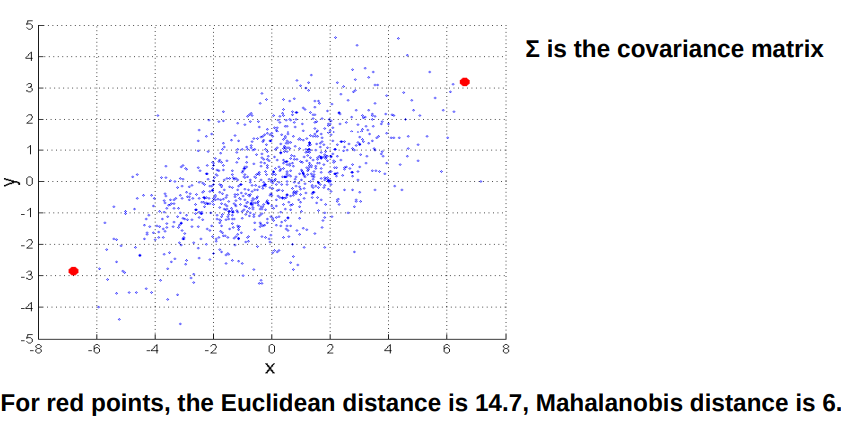
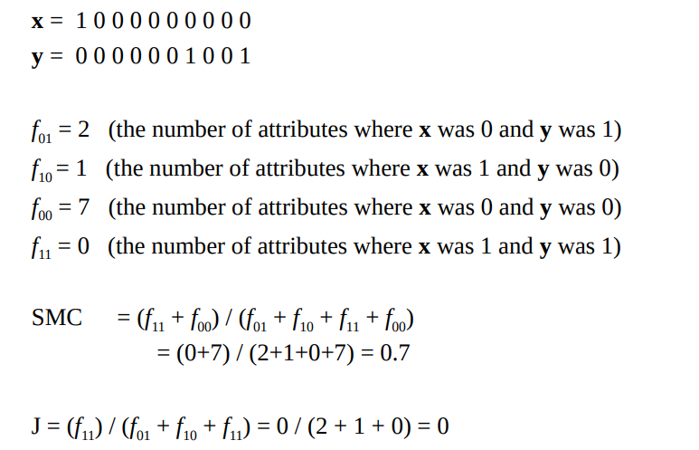
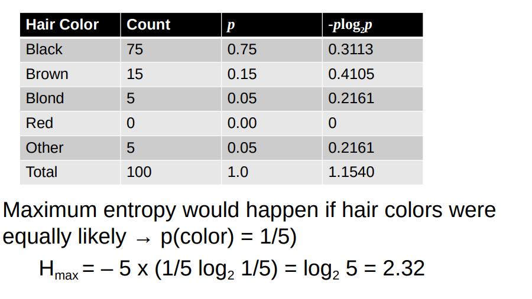

# (di)Similarity

## Medidas de Similarity e Dissimilarity


* ```Medida Similarity```
    * Medida númerica sobre **quão parecidos dois objeto de dados são** 
    * **É maior quando objetos são mais parecidos**
    * Frequentemente cai no **intervalo [0,1]**

* ```Medida Dissimilarity```
    * Medida númerica sobre **quão diferentes dois objetos de dados são**
    * **É mais pequena quando objetos são mais parecidos**
    * Dissimilarity minima é tipicamente 0 
    * Limite superior vária

* ```Proximity```
    * Refere-se a uma Similarity ou Dissimilarity


> Ambas as medidas acimas podem ser usadas  tanto para **comparar objetos** quanto  para **comparar features** 


## Atributos simples para Similarity/Dissimilarity

* A tabela a seguir mostra a **Similarity** e a **Dissimilarity**
entre dois objetos, *x* e *y*, em relação a um **único atributo
simples**


## Euclidean Distance


$$
n= número\ de\ dimensões \ (features)
$$
$$
x_k,y_k = consistem\ nas\ k^t\ features\ (componentes) \ ou \ data  \ objects \ x \ y
$$ 

* ```Standardization``` é necessária se escala diferir
    * A ```Standardization``` (**transformar as variáveis** para terem **média 0** e **desvio padrão 1**) coloca **todas as variáveis na mesma escala**, garantindo que **todas contribuam de forma igual para o cálculo da distância**.


## Minkowski Distance

* Minkowski Distance é uma generalização of Euclidean
Distance


$$
r = parametro
$$
$$
n= número\ de\ dimensões \ (features)
$$
$$
x_k,y_k = consistem\ nas\ k^t\ features\ (componentes) \ ou \ data  \ objects \ x \ y
$$ 

### Minkowski Distance: Examples
* **r=1** : Manhattan, taxicab, L1
 norm

* **r=2**: Euclidean distance

* **r->∞**: “supremum” (Lmax norm, L∞ norm) distance. 
    * Esta é a diferença máxima entre qualquer componente
dos vetores

* Não confundir *r* com *n*fe, ou seja, todas essas distâncias são definidas
para todos os números de dimensões.


## Mahalanobis Distance

$$
\text{mahalanobis}(x, y) = ((x - y)^{\text{T}} \Sigma^{-1} (x - y))^{0.5}
$$

* A **Distância de Mahalanobis** é a **Distância Euclidiana** ajustada pela **escala e correlação das variáveis**.
    * Mede **quantos desvios-padrão um ponto está distante do centro da distribuição**.
    * É **robusta contra variáveis em escalas diferentes e correlacionadas**, sendo ideal para detecção de outliers multivariados.




### Mahalanobis Distance vs Euclidian Distance

| Medida | Cenário de Uso Recomendado |
| :--- | :--- |
| **Distância Euclidiana** | 1. Variáveis na **mesma escala** e/ou **não correlacionadas**.<br> 2. Quando **velocidade** e simplicidade são cruciais. <br>3. Distribuições de dados aproximadamente **esféricas**. |
| **Distância de Mahalanobis** | 1. Variáveis **correlacionadas** ou em **escalas muito diferentes**. <br> 2. **Detecção de *Outliers* Multivariados**. <br>3. Agrupamento em dados com estrutura **elipsoidal**. |


## Propriedades comuns de Distâncias

* **Distâncias**, como a distância euclidiana,
têm algumas propriedades bem conhecidas.

    1. **d(x, y) ≥ 0** para todo x e y e **d(x, y) = 0** sse  **x = y**
    2. **d(x, y) = d(y, x)** para todo o x e y (```Simetria```)
    3. **d(x, z) ≤ d(x, y) + d(y, z)** para todos os pontos x, y, e z. (Triangle Inequality)

> **d(x, y)** é a distância (**dissimilarity**) entre
os pontos (objetos de dados), x e y.

* Uma **distância que satisfaz estas propriedades** é uma
```métrica```


## Propriedades comuns de Similarity

* **Similarities**, também possuem algumas propriedades
bem conhecidas.

    1. **s(x, y) = 1** (ou ```maximum similarity```) sse **x = y**
    2. **s(x, y) = s(y, x)** para todo x e y. (```Simetria```)

> **s(x, y)** é a similaridade(**Similarity**) entre pontos (objetos de dados), x e y

## Similarity entre Vectores binários

* Uma **situação comum** é que os **objetos x e y** têm **apenas atributos binários**

* **Calculamos semelhanças** usando as seguintes quantidades: 

$f_{01}$: O número de atributos onde **$x$ foi $0$ e $y$ foi $1$**.

$f_{10}$: O número de atributos onde **$x$ foi $1$ e $y$ foi $0$**.

$f_{00}$: O número de atributos onde **$x$ foi $0$ e $y$ foi $0$**.

$f_{11}$: O número de atributos onde **$x$ foi $1$ e $y$ foi $1$**.

* Temos dois métodos principais para estas situações
    * ```Simple Matching Coefficients```

$$\text{SMC} = \frac{\text{número de matches}}{\text{número de atributos}}$$

$$\text{SMC} = \frac{f_{11} + f_{00}}{f_{01} + f_{10} + f_{11} + f_{00}}$$

* * ```Jaccard Coefficients```

$$J = \frac{\text{número de matches } 11}{\text{número de atributos não-zero (pelo menos um é 1)}}$$

$$J = \frac{f_{11}}{f_{01} + f_{10} + f_{11}}$$


> O SMC e J são semelhantes, a unica diferença é que um considera o $f_\text{00}$ e o outro não


### SMC versus Jaccard: Exemplo




## Cosine Similarity

Se $\mathbf{d}_1$ e $\mathbf{d}_2$ são dois vetores de documentos, a Similaridade de Cosseno é definida como:

$$\cos(\mathbf{d}_1, \mathbf{d}_2) = \frac{\langle \mathbf{d}_1, \mathbf{d}_2 \rangle}{\|\mathbf{d}_1\| \|\mathbf{d}_2\|}$$

Onde:
* $\langle \mathbf{d}_1, \mathbf{d}_2 \rangle$: Indica o **produto interno** (ou produto escalar) dos vetores $\mathbf{d}_1$ e $\mathbf{d}_2$.
* $\|\mathbf{d}\|$: É o **comprimento (norma Euclidiana)** do vetor $\mathbf{d}$.


Casos de uso de Cosine Similarity: 
1. Análise de Texto/NLP: Quer medir a similaridade de tópico entre documentos, ignorando o seu comprimento.

2. Sistemas de Recomendação: Compara perfis de usuários/itens, onde a frequência não deve distorcer a similaridade.

3. Dados de Alta Dimensão: Em vetores esparsos, focando na direção em vez da magnitude.


## Correlation measures the linear relationship between object


### Visually Evaluating Correlation


* Os scatter plots acima mostram que:
    * **Correlação de 1.00 e −1.00**: 
        * Os pontos formam uma linha perfeita (**relação linear forte(**).

    * **Correlação Próxima de Zero (0.00 a ±0.30)**: 
        * Os pontos formam uma nuvem circular/dispersa (**relação linear fraca ou inexistente**).

    * **Correlação Positiva (+)**: 
        * Os pontos seguem uma **inclinação crescente**.

    * **Correlação Negativa (-)**: 
        * Os pontos seguem uma **inclinação decrescente**.

### Drawback of Correlation


* Explicação
    * O exemplo mostra uma relação perfeita entre $x$ e $y$, dada por $y_i=x i^2$ (uma parábola), que é **uma relação não linear**. 
    * **Apesar da dependência ser clara**, o resultado da correlação (**corr=0**) **sugere que não há relação entre as variáveis**.

    * Isto prova que a **Correlação de Pearson falha ao capturar qualquer tipo de relação que não possa ser representada por uma linha reta**.


## Correlation vs Cosine vs Euclidean Distance

* **Comparar as três medidas de proximidade** de acordo com seu **comportamento sob transformação de variáveis**
    * ```Scaling```: multiplicação por um valor
    * ```Translation```: adição de uma constante

| Propriedade | Cosine | Correlation | Euclidean Distance |
| :--- | :--- | :--- | :--- |
| **Invariante à Escala (Multiplicação)** | Sim | Sim | Não |
| **Invariante à Translação (Adição)** | Não | Sim | Não |
| **Conclusão Breve** | Foca na **direção** (ângulo). | Foca na **forma** da relação. | Foca na **magnitude** (distância absoluta). |


###  Correlation vs Cosine vs Euclidean Distance (comparação de tabela)

## Comparação de Medidas de Dissimilaridade e Similaridade

| Característica | Correlação (Pearson) | Similaridade de Cosseno | Distância Euclidiana |
| :--- | :--- | :--- | :--- |
| **Tipo de Medida** | Similaridade (relação linear) | Similaridade (ângulo) | Dissimilaridade (distância) |
| **Intervalo Comum** | $[-1, +1]$ | $[0, +1]$ ou $[-1, +1]$ | $[0, +\infty)$ |
| **Sensibilidade à Escala** | Não (Invariante) | Não (Invariante) | **Sim** (Muito Sensível) |
| **Sensibilidade à Translação** | Não (Invariante) | **Sim** (Sensível) | **Sim** (Sensível) |
| **Foco Principal** | **Forma** da relação linear entre variáveis. | **Direção** (ângulo) entre vetores. | **Magnitude** da diferença entre pontos. |
| **Melhor Uso** | Análise de Variáveis, Relações Lineares. | Análise de Texto (NLP), Dados Esparsos de Alta Dimensão. | Dados Numéricos Padronizados, Distâncias Físicas. |

## Information Based Measures

* A teoria da informação é uma disciplina bem desenvolvida e fundamental com amplas aplicações

* Some similarity measures are based on
information theory
    * Mutual information em varias versões
    * Maximal Information Coefficient (MIC) medidas relacionadas
    * Génericas e podem lidar com relações não lineares 
    * Pode ser complicado e demorado para calcular


### Informação e Probabilidade
 
* As informações estão relacionadas aos possíveis resultados de um evento
    * transmissão de uma mensagem, cara ou coroa ou medição de um dado

* **Quanto mais certo for um resultado, menos informação ele contém e vice-versa**.
    * e.g. se uma moeda tem duas caras, então um resultado de caras não fornece nenhuma informação.
    * De forma mais quantitativa, a **informação está relacionada à probabilidade de um resultado**.
    * A ```Entropy``` é uma medida tipicamente usada


> Se o **evento for altamente provável** (próximo de 1), a **informação obtida será pequena**.

> Se o **evento for improvável** (próximo de 0), a **informação obtida será grande**.


### Entropy

> \+ mais usada em discrete data 

* Para uma variável (evento) $X$, com $n$ valores possíveis (resultados) $x_1, x_2, \dots, x_n$, onde cada resultado tem probabilidade $p_1, p_2, \dots, p_n$

* A entropia de $X$, $H(X)$, é dada por:

$$
H(X) = - \sum_{i=1}^{n} p_i \log_2 p_i
$$

* A Entropia está entre $0$ e $\log_2 n$ e é medida em **bits**.
* Assim, a entropia é uma medida de **quantos bits são necessários**, em média, para representar uma observação de $X$.

#### Exemplo de Entropy


#### Entropy for Sample Data
* Supondo que temos:
    *   Um número de observações ($m$) de algum atributo $X$ (ex: cor do cabelo dos alunos na turma).
    * Existem $n$ diferentes valores possíveis.
    * O número de observações na $i$-ésima categoria é $m_i$.

    * Então, a entropia para esta amostra é dada por:

$$
H(X) = - \sum_{i=1}^{n} \frac{m_i}{m} \log_2 \frac{m_i}{m}
$$
(Note que a probabilidade $p_i$ é aqui substituída pela frequência relativa $\frac{m_i}{m}$).

* Para dados continuos, o cáculo é mais dificil

#### Entropy for Sample Data: Exemplo 



### Mutual Information

* Formalmente, a Informação Mútua entre duas variáveis aleatórias $X$ e $Y$ é dada por:

$$
I(X, Y) = H(X) + H(Y) - H(X, Y)
$$


* Onde $H(X)$ e $H(Y)$ são as entropias individuais de $X$ e $Y$, e $H(X, Y)$ é a **Entropia Conjunta** de $X$ e $Y$.


$$
H(X, Y) = - \sum_{x \in X} \sum_{y \in Y} p(x, y) \log_2 p(x, y)
$$

* Onde $p(x, y)$ é a probabilidade conjunta de $X$ e $Y$.


#### Mutual Information Example


#### Maximal Information Coefficient
>  Reshef, David N., Yakir A. Reshef, Hilary K. Finucane, Sharon R. Grossman, Gilean McVean, Peter
J. Turnbaugh, Eric S. Lander, Michael Mitzenmacher, and Pardis C. Sabeti. "Detecting novel
associations in large data sets." science 334, no. 6062 (2011): 1518-1524.

> Informação deste slide vem deste paper

* Aplica **informação mútua a duas variáveis ​​contínuas**


#### General Approach for Combining Similarities

* Quando os atributos são de muitos tipos diferentes, mas é necessária uma similaridade geral, o processo é o seguinte:

    1.  **Calcular Similaridade Individual:** Para o $k$-ésimo atributo, calculamos uma similaridade, $s_k(\mathbf{x}, \mathbf{y})$, no intervalo $[0, 1]$.

    2.  **Definir Variável Indicadora ($\delta_k$):** Defenimos uma variável indicadora, $\delta_k$, para o $k$-ésimo atributo da seguinte forma:
        * $\delta_k = 0$ se o $k$-ésimo atributo for um atributo **assimétrico** e ambos os objetos tiverem um valor de $0$, **ou** se um dos objetos tiver um valor omisso (*missing value*) para o $k$-ésimo atributo.
        * $\delta_k = 1$ caso contrário.

    3.  **Calcular Similaridade Geral:** Calcule a similaridade agregada entre $\mathbf{x}$ e $\mathbf{y}$ pela média ponderada das similaridades individuais:

$$
\text{similarity}(\mathbf{x}, \mathbf{y}) = \frac{\sum_{k=1}^{n} \delta_k s_k(\mathbf{x}, \mathbf{y})}{\sum_{k=1}^{n} \delta_k}
$$

> Ficamos aqui