# Data Statistics and Visualization 


https://www.atlassian.com/data/charts/how-to-choose-data-visualization


## What is data exploration?

* Uma **exploração preliminar dos dados** permite
**entender melhor suas características**.

* As **principais motivações** da exploração de dados incluem
    * **Ajudar** a **selecionar a ferramenta** certa para **pré-processamento** ou **análise**
    * Utilizar as **habilidades humanas para reconhecer padrões**
        * As pessoas podem reconhecer padrões não capturados pelas ferramentas de análise de dados

* Relacionado à área de Exploratory Data Analysis (EDA) 


## Techniques Used In Data Exploration 

* Na nossa discussão sobre exploração de dados, focamos em:
    * **Estatisticas resumidas**
    * **Visualização**
    * **Online Analytical Processing (OLAP)** 


## Iris Sample Data Set 

* Muitas das técnicas de dados exploratórios são
ilustradas com o dataset  de plantas **Iris**.
* No dataset **Iris** temos:
    * Três tipos de flores (**classes**):
        * Setosa
        * Virginica 
        * Versicolor
    * Quatro atributos  
        * Largura e comprimento da sépala
        * Largura e comprimento da pétala


### Summary Statistics

* **Estatísticas resumidas** são **números que resumem propriedades dos dados**
    * Propriedades resumidas incluem **frequência**, **localização** e **dispersão**
        * Exemplos: 
            * **localização** - média
            * **dispersão** - desvio padrão
    * A maioria das **estatísticas resumidas** pode ser **calculada em uma única passagem pelos dados**

### Frequency and Mode

* A **frequência** de um **valor de atributo** é a **percentagem de vezes que o valor ocorre no dataset**
    * Por exemplo, dado o atributo "gênero" e uma população representativa de pessoas, o gênero "feminino" ocorre cerca de 50% das vezes.
* A **moda** de um **atributo** é o **valor de atributo mais frequente**
* As noções de **frequência** e **moda** são ```normalmente usadas com dados categóricos```


### Central tendency

* μ: média (variáveis ​​numéricas)
    * Média ponderada
* Mediana (variáveis ​​ordinais, incluindo numéricas)

* Moda (qualquer variável)

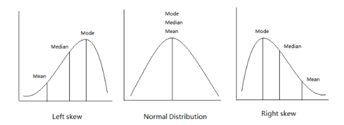

>A imagem acima ilustra como a **forma da distribuição afeta a posição das medidas de tendência central**

### Measures of Location: Mean and Median

* A **média** é a medida mais comum da
localização de um conjunto de pontos.

* No entanto, a **média** é **muito sensível a Outliers**.
* Assim, a **mediana** ou uma **média aparada** também é comumente usada.


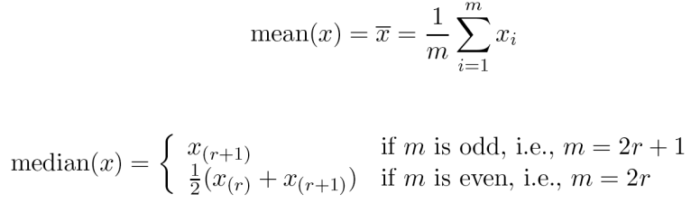

### Measures of Spread (dispersion)

* Estas medidas servem para descrever o **quão dispersos ou espalhados estão os dados num conjunto**.


| Medida | Para que serve | Fórmula/Definição |
| :--- | :--- | :--- |
| **Amplitude (Range)** | Diz qual é a **distância total** entre o valor mais baixo e o mais alto. | $\text{Máx} - \text{Mín}$ |
| **Quartis** ($\text{Q}_1, \text{Q}_2, \text{Q}_3$) | Dividem o conjunto de dados em **quatro partes iguais**, cada uma contendo 25% dos dados. ($\text{Q}_2$ é a Mediana). | Divisão do conjunto de dados ordenados. |
| **Resumo de 5 Números (5-number summary)** | Oferece uma **visão geral rápida** da distribuição e dispersão dos dados. | $\text{Mín}, \text{Q}_1, \text{Mediana}, \text{Q}_3, \text{Máx}$ |
| **Amplitude Interquartil (IQR)** | Diz-nos o quão dispersos estão os **50% centrais** dos dados, sendo menos sensível a *outliers* (valores extremos). | $\text{Q}_3 - \text{Q}_1$ |


#### Percentiles

* Para dados contínuos, a noção de percentil é mais útil.

* Dado um **atributo ordinal ou contínuo $x$** e um
**número $p$ entre 0 e 100**, o **p-ésimo percentil é um valor** de **$x_p$** **tal que $p\%$ dos valores observados de x são menores que $x_p$** .
* Por exemplo, o **50º percentil** é o valor $x_\text{50\%}$
tal que **50% de todos os valores de x são menores que *$x_\text{50\%}$* .

#### Measure of Spread: Variance

* A **variância ou desvio padrão** é a **medida mais
comum da dispersão** de um conjunto de pontos

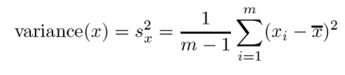

* No entanto, isto **também é sensível** a ```Outliers```, de  modo que outras medidas são frequentemente utilizadas

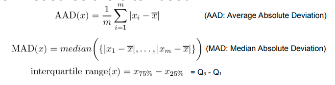

#### Outliers

* **Valores bastante fora do range esperada** de observações
* **Várias maneiras** de ```definir/detectar outliers```
*  Geralmente:
    * $x >= Q3 +1,5 \times IQR$ 
    * ou
    * $x <= Q1 – 1,5 \times IQR$
* ```Outliers``` podem ser `**visualizados com um boxplot**

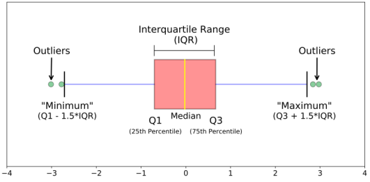

## Missing values
* O que fazer?
    * Nada
    * Ignorar o atributo
    * Ignorar a tupla
    * Imputar valores (preencher)

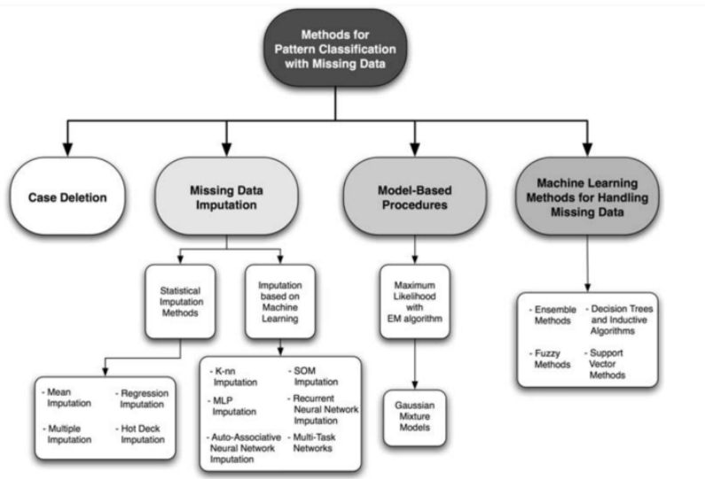


* ```Se``` o **método for robusto a dados ausentes** ```e``` **a quantidade de dados ausentes não for muito alta**
    * ```não fazer nada nada```
* ```Caso contrário```
    * ```Se``` **apenas alguns casos apresentarem problemas**
        * ```ignorar os casos```
    * ```Se``` o **problema estiver em atributos descartáveis**
        * ```ignorar o atributo```
    * ```Se``` os **valores ausentes persistirem**
        * ```tentar a imputação de valor```

> Devemos verificar sempre qual é melhor forma de lidar com Missing values (ter cuidado)

### Data imputation

>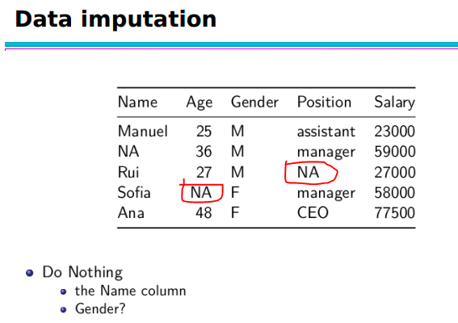
> imagem sugere **não fazer nada** com valores vazios nas colunas gender e position


>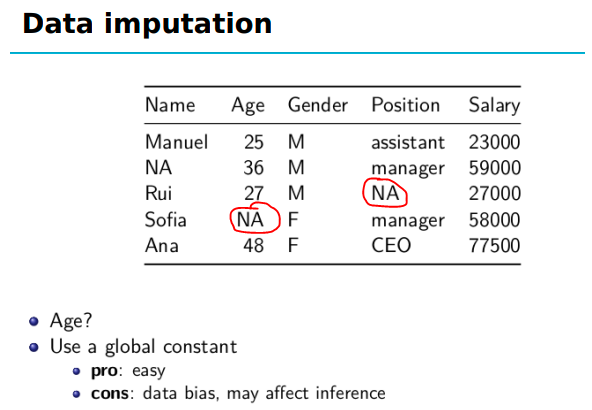
>imagem está a discutir a **imputação** da Idade usando uma **constante global**, destacando que, apesar de ser fácil, é arriscado devido ao potencial Bias que pode introduzir nos dados.

>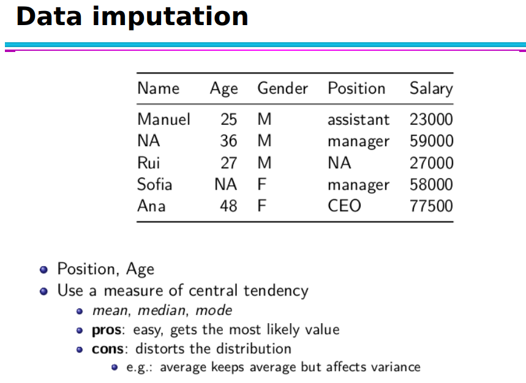
>a imagem discute a **imputação** usando a ((Média, Mediana ou Moda)) como uma solução fácil, mas alerta que este método distorce a variância e a forma real da distribuição dos dados.


>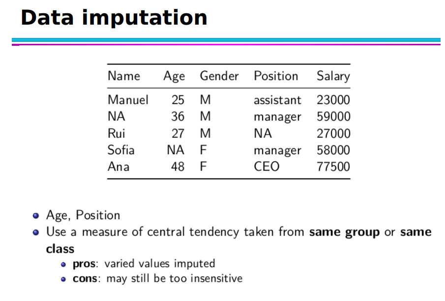
>a imagem propõe uma **imputação** mais sofisticada e contextualizada, preenchendo os valores em falta com base na **média/mediana/moda de um subgrupo**, o que é melhor que a média global, mas ainda imperfeito.

>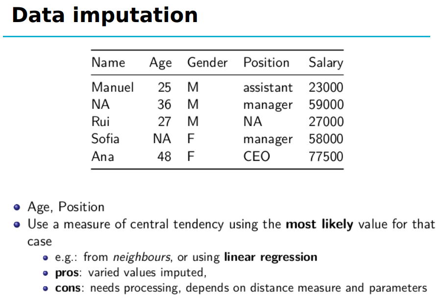
>a imagem descreve a **imputação** avançada baseada em **técnicas de Machine Learning** (como vizinhos ou regressão), que oferece melhor precisão (variedade) mas é mais difícil de implementar.

### Noisy data

* **Ruído**
    * Erro aleatório ou variância de uma variável medida
* **Smoothing**
    * Suponha que um valor é sempre semelhante aos seus vizinhos
    * Substituir valores (mais forte que a imputação)
* **Outliers**
    * Podem ser suavizados se assumirmos que são ruído
* Ter muito cuidado
    * Não fazer **smoothing** dados legítimos (a menos que ajude)

#### Smoothing

>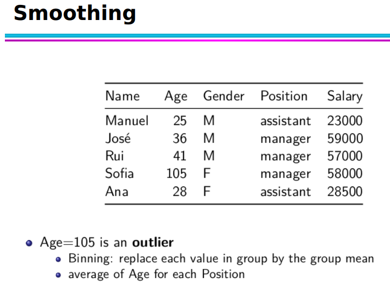
> a imagem demonstra o **problema de outliers** (**Idade = 105**) e sugere a **técnica de Binning** (usando a média do grupo 'Position') como forma de**smoothing** o **outlier** e tornar os dados mais consistentes.

>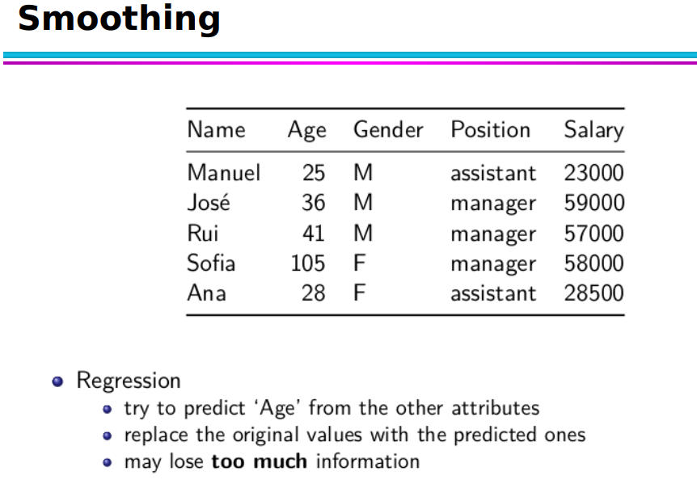
> a imagem propõe usar a **Regressão** para **prever e substituir os valores da "Idade"**, o que **pode remover outliers**, mas alerta que esta técnica arrisca a perda de muita informação original dos dados

> 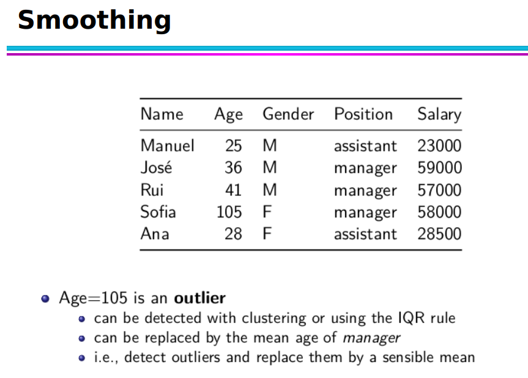
> a imagem ensina que o processo de **smoothing para outliers** envolve **primeiro detetá-los** (com técnicas como Clustering ou IQR) e **depois substituí-los por uma média contextualizada**(como a média do grupo) para limpar os dados.

>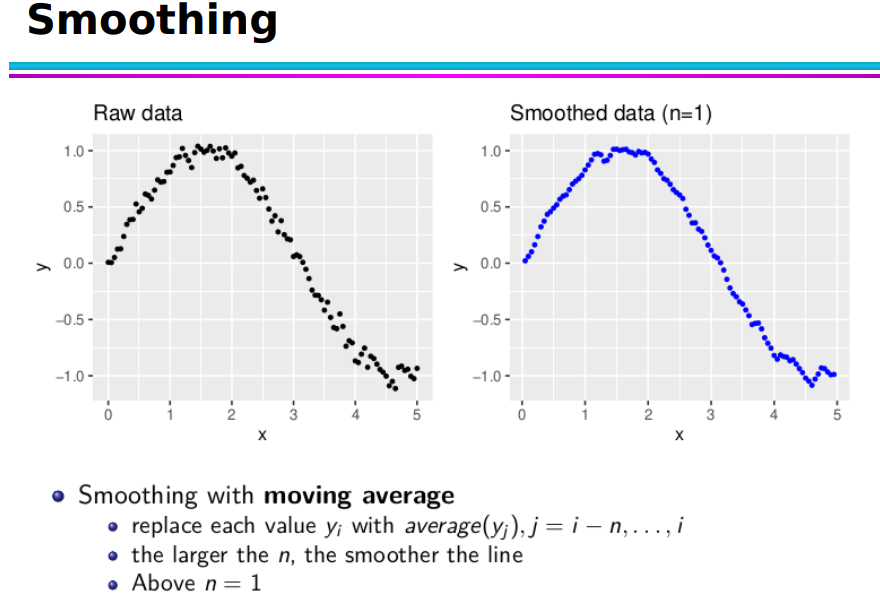
> a imagem demonstra visualmente como a **Média Móvel "limpa" o ruído dos dados**, revelando a tendência real, e explica que o **grau de smoothing é controlado pelo tamanho da janela** ($n$).

>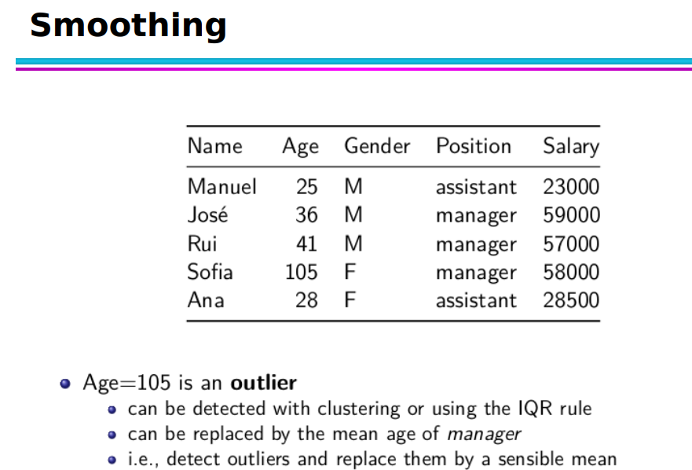
>a imagem demonstra o **processo de identificar outliers** e **usar uma média relevante do grupo para os substituir**, "suavizando" assim o ruído nos dados.

## Visualization

* **Visualização** é a **conversão de dados** num **formato visual ou tabular** para que as **características dos dados** e os **relacionamentos entre itens de dados ou atributos** possam ser *analisados ​​ou relatados*.


### Example: Sea Surface Temperature

>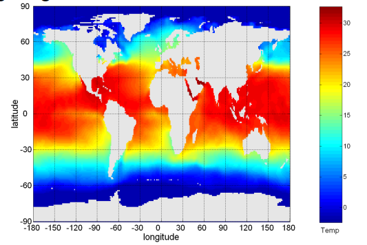
> Dezenas de milhares de pontos de dados são resumidos num único número

### Representation

* É o **mapeamento de informações** para um **formato visual**

* Objetos de dados, seus atributos e os relacionamentos
entre objetos de dados são traduzidos em elementos
gráficos, como pontos, linhas, formas e
cores.

* Exemplo
    * **Objetos** são frequentemente **representados como pontos**
    * Os seus **valores de atributos** podem ser **representados como a posição dos pontos** ou as **características dos pontos** (e.g. cor, tamanho e forma)
    * Se a **posição for usada**, então as **relações dos pontos**, ou seja,se eles **formam grupos** ou se um **ponto é um outlier**, são facilmente percebidas.

> Nota : Objetos de dados, representa a linha de uma tabela


### Arrangement

* O **posicionamento** dos **elementos visuais** num display
* Pode fazer uma grande diferença na **facilidade de
compreensão dos dados**

>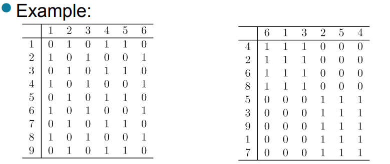
> A imagem demonstra como a reordenação pode facilitar a visualização

### Selection

* É a **eliminação** ou a **redução  da ênfase** de **certos** ```objetos``` e ```atributos```
* A **seleção** pode **envolver a escolha de um subconjunto de atributos**
    * A **redução de dimensionalidade** é frequentemente usada para **reduzir o número de dimensões** para duas ou três
    * Alternativamente, pares de atributos podem ser considerados
* A **seleção** também pode envolver a **escolha de um subconjunto de objetos**
    * Uma região da tela só pode mostrar um número limitado de pontos
    * Pode amostrar, mas deseja preservar pontos em áreas esparsas


## Visualization Techniques: Histograms

* ```Histograma```

    * Geralmente mostra a **distribuição de valores de uma única variável**
    * **Divide** os **valores em "caixas"** e **mostra um gráfico de barras do número de objetos em cada "caixa"**.
    * A **altura de cada barra** indica o **número de objetos**
    * O formato do histograma depende do número de "caixas"

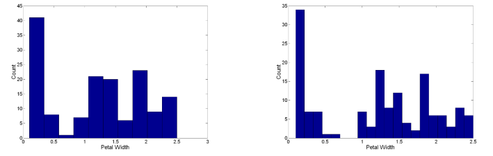


### Two-Dimensional Histograms

* Mostrar a **distribuição conjunta** dos **valores de dois atributos**

>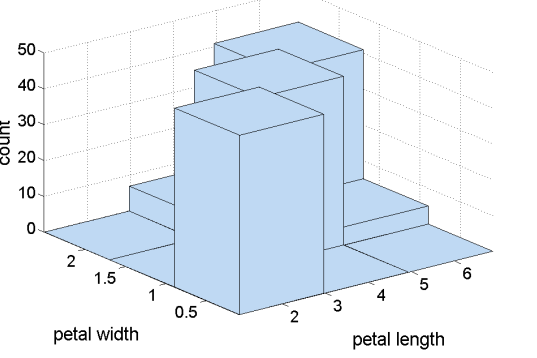
>Exemplo de Histograma 2d com petal width e petal length
## Visualization Techniques: Box Plots

* ```Box plots```
    * Outra maneira de **exibir a distribuição de dados**
    
>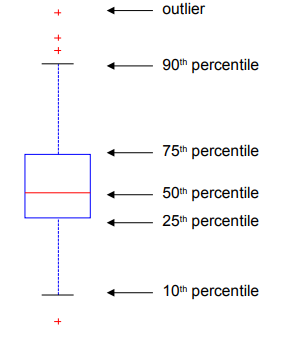
> A imagem mostra a Legenda de um Box plot

### Example of Box Plots

* As ```box plots``` podem ser usadas para **comparar atributos**

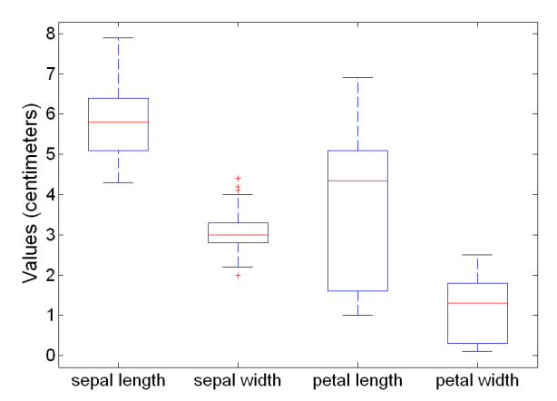

## Visualization Techniques: Scatter Plots

* ```Scatter plots```
    * Os **valores dos atributos determinam a posição**
    * **Diagramas de dispersão bidimensionais são os mais comuns**, mas podem ter diagramas de dispersão tridimensionais
    * Frequentemente, atributos adicionais podem ser exibidos usando o tamanho, a forma e a cor dos marcadores que representam os objetos
    * É útil ter **matrizes de diagramas de dispersão** que possam **resumir de forma compacta as relações de vários pares de atributos**
        * ver figura abaixo, com exemplo 

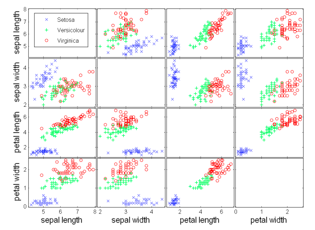

## Visualization Techniques: Contour Plots

* ```Contour plots```

* Útil quando um **atributo contínuo é medido em uma grade espacial**
* Eles **dividem o plano em regiões de valores semelhantes**
* As **curvas de nível** que **formam os limites dessas regiões** conectam pontos com valores iguais
* O exemplo mais comum são os mapas de curvas de nível de elevação
* Também podem exibir temperatura, precipitação, pressão atmosférica, etc.
    * ver figura abaixo com exemplo

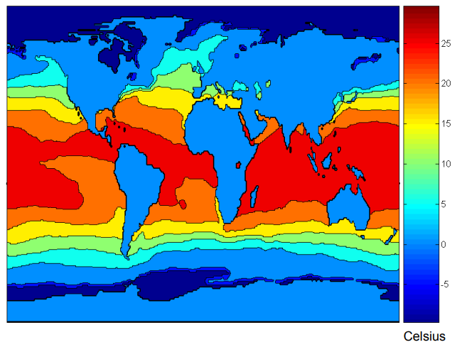


## Visualization Techniques: Matrix Plots


* ```Matrix plots```
    * Fazer o **plot de uma a matriz de dados**
    * Isso pode ser **útil** quando os **objetos são classificados de acordo com a classe**
    *  Normalmente, os **atributos são normalizados para evitar que um atributo domine o gráfico**
    * Gráficos de **matrizes de similaridade ou distância** também podem ser **úteis para visualizar as relações entre objetos**
    * Exemplos de gráficos de matriz são apresentados nas duas figuras abaixo (Iris data matrix e Iris Correlation Matrix respetivamente )

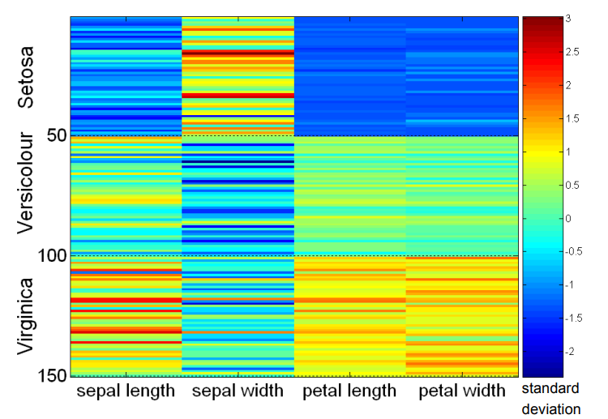

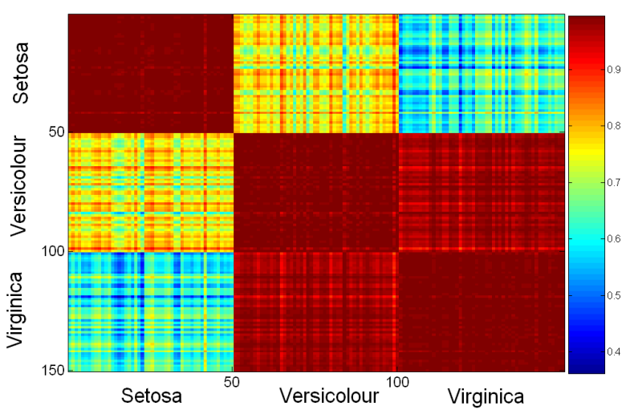


## Visualization Techniques: Parallel Coordinates

* ```Coordenadas Paralelas```
    * Usado para **fazer o plot** os **valores de atributos de dados de alta dimensão**
    * Em vez de usar eixos perpendiculares, use um conjunto de eixos paralelos
    * Os **valores de atributos de cada objeto** são **ploted como um ponto em cada eixo de coordenadas** correspondente e os **pontos são conectados por uma linha**
    * Assim, **cada objeto** é **representado como uma linha**
    * **Frequentemente**, as **linhas que representam uma classe distinta de objetos agrupam-se**, pelo menos para alguns atributos
    * A **ordenação dos atributos** é **importante para visualizar tais agrupamentos**

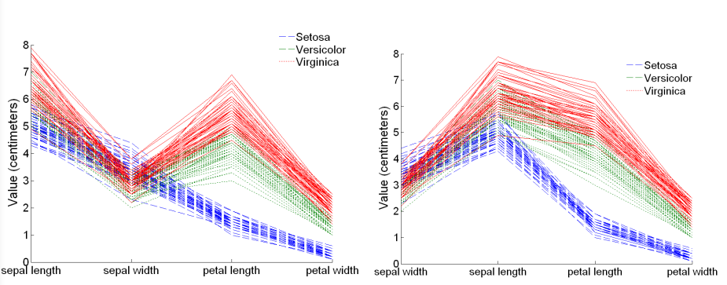

## Other Visualization Techniques

* ```Star Plots```
    * **Abordagem semelhante às coordenadas paralelas**, mas os **eixos irradiam de um ponto central**
    * A linha que conecta os valores de um objeto é um polígono
* ```Chernoff Faces```
    * Esta abordagem **associa cada atributo a uma característica de um rosto**
    * Os **valores de cada atributo** determinam a **aparência da característica facial correspondente**
    * Cada objeto se torna um rosto separado
    * Baseia-se na capacidade humana de distinguir rostos

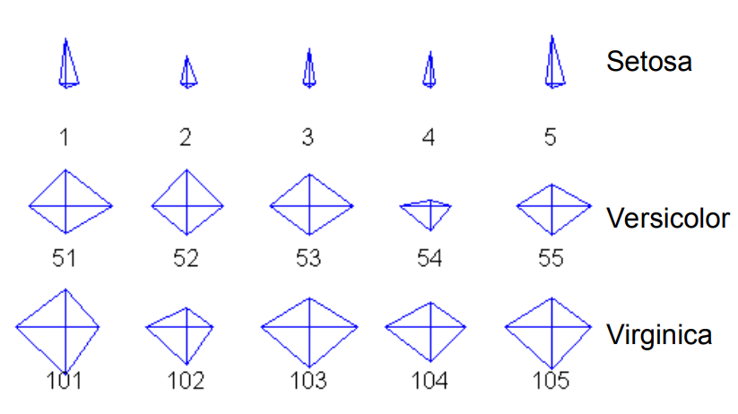

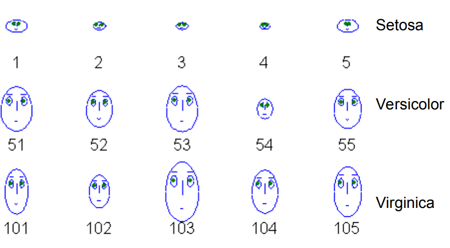


### UpSet Plot

* Útil para **traçar interseções entre conjuntos de valores**

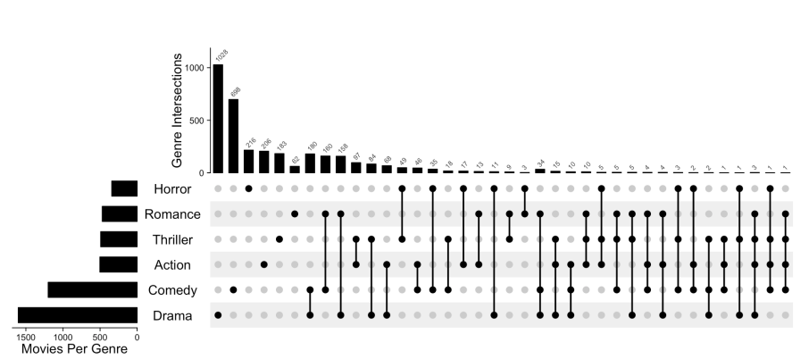

### OLAP


* Basos de dados relacionais colocam dados em tabelas, enquanto o **OLAP usa uma representação de matriz multidimensional**.
* Há uma **série de operações de análise** e **exploração de dados** que são **mais fáceis com essa representação de dados**.


#### Creating a Multidimensional Array

* **Duas etapas principais** na ```conversão de dados tabulares em uma matriz multidimensional```.

* ```Primeiro```
    * **identificar** quais **atributos serão as dimensões** e qual **atributo será o atributo de target**, cujos **valores** aparecem como **entradas na matriz multidimensional**.
        * Os **atributos usados ​​como dimensões devem ter valores discretos**
        * O **valor de target** normalmente é uma **contagem ou um valor contínuo** (e.g. o custo de um item)
        * **Não pode ter nenhuma variável de target**, **exceto a contagem de objetos** que possuem o mesmo conjunto de valores de atributo
* ```Segundo``` 
    * encontrar o **valor de cada entrada na matriz multidimensional** somando os valores (do atributo de target) ou a **contagem de todos os objetos que possuem os valores de atributo correspondentes a essa entrada**.

#### Example: Iris data

* Mostramos como os **atributos** ```petal length```, ```petal width``` e ```species``` podem ser **convertidos numa matriz multidimensional**
    * ```Primeiro```, **discretizamos** a ```petal length``` e o ```petal width``` para **obter valores categóricos**
        * Low 
        * Medium
        * High
    * Obtemos a seguinte tabela - de notar o atributo count

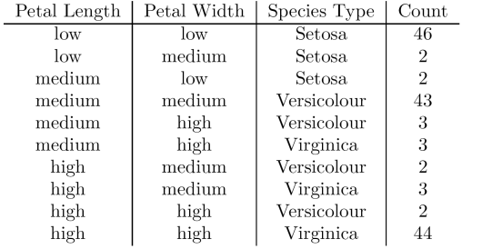

#### Example: Iris data (continued)

* Cada **tuplo única** de ```Petal width```, ```Petal length``` e ```Species``` **identifica um elemento do array**.
* **A este elemento é atribuído o valor de contagem correspondente**.
* A figura abaixo ilustra o resultado.
    * Todas as tuplas não especificadas são 0.

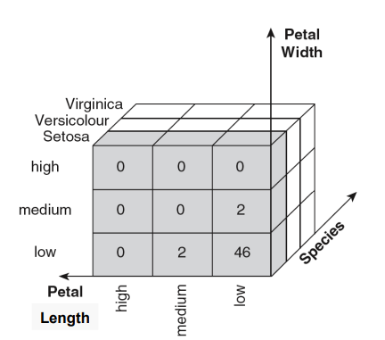

#### Example: Iris data (continued 2)

* **Fatias da matriz multidimensional** são mostradas pelas **seguintes tabulações cruzadas**

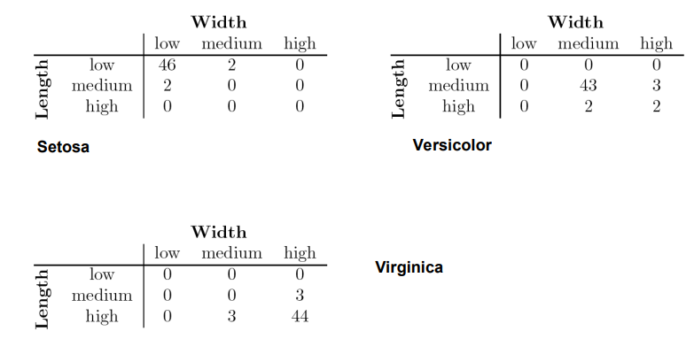

> As tabelas mostram claramente que ````Petal Width```` e ```Petal Length``` são **características excelentes para distinguir as três espécies de íris**, com:
>* a Setosa é pequena
>* a Versicolor é intermédia 
>* a Virginica é grande.