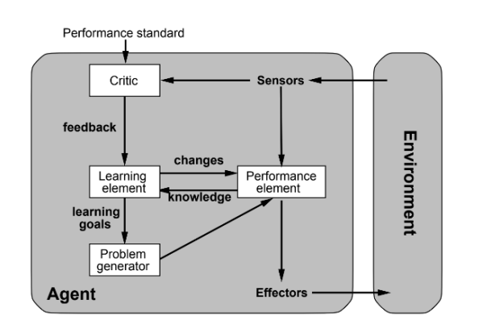
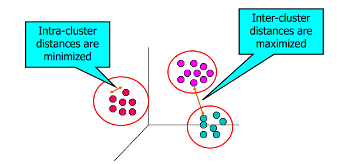
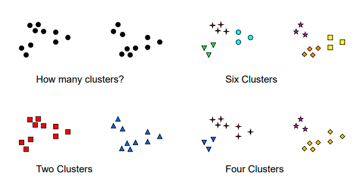

# Clustering 
> TODO: traduzir para portugues e fazer respetivos apontamentos 

> Professora recomendou ver o capitulo de clustering do livro **mining massive datasets** (esta disponivel online)

## Components of an agent that learn 

> Pedir LLM para explicar cada componente desta imagem 

## Learning from observations

> Todo: fazer apontamentos e perceber o que cada ponto refere (são dois slides)

## A definition for learning 

* Uma agente **aprende** se melhorar a sua performance em tarefas futura depois de fazer observações sobre o passado ou mundo atual 

## Machine learning: very brief overview 

> ver slides (são dois slides)

### Inductive learning 

> ver slides (são dois slides)

### Algorithms for learning
* Various algorithms for learning from observations

    * **Unsupervised**  
        * Clustering
        * Association rules
        * Regression
    * **Supervised**
        * Regression
        * Decision trees
        * Bayesian networks
        * SVM
        * Neural Networks

> Colocar aqui a prinpal diferença entre supervised e unsupervised

### Important 

* Each algorithm has some assumptions
    * Input data type and format
    * Implementations of the same algorithm may vary and may not produce the same results
    * Check for documentation

## What is Cluster Analysis?

> Quando usamos Clustering, assumimos que os dados são numericas, porque a noção de clustering implica calculos de distância (quando temos mixed data, e.g. categorica , podemos pegar apenas nos dados númericos ou se quiseremos manter os dados categoricos, podemos aplicar enconding)

* Given a set of objects, place them in groups such that the
objects in a group are similar (or related) to one another and
different from (or unrelated to) the objects in other groups

### Applications of Cluster Analysis

> ver exemplo 

### Notion of a Cluster can be Ambiguous

### Types of Clusterings

>non-overlapping, implica que um ponto apenas pode pertencer a um cluster

* A clustering is a set of clusters
* Important distinction between hierarchical and partitional sets of clusters
    * Partitional Clustering
        * A division of data objects into non-overlapping subsets (clusters)
* Hierarchical clustering
    * A set of nested clusters organized as a hierarchical tree

#### Partitional Clustering

> Por figura

#### Hierarchical Clustering 

> Por figura

### Other Distinctions Between Sets of Clusters

> Ver slides  

### Types of Clusters 

> ver slides 

#### Types of Clusters: Well-Separated

> ver slides 

#### Types of Clusters: Prototype-Based

> ver slides

#### Types of Clusters: Contiguity-Based

> ver sildes 

#### Types of Clusters: Density-Based

> ver slides

#### Types of Clusters: Objective Function

> ver slides 

### Characteristics of the Input Data Are Important (for clustering)

> ver slides 

### Clustering Algorithms

> ver slides 

#### K-means Clustering

> ver slides 

> Para escolher o k podemos usar algoritmos com o SSE (pedir llm para dizer métodos para escolher o valor de k)

> perceber o qu é o centroid em clustering 

##### Example of k-means clustering

> ver slides (as figuras mostram as iterações do algoritmo de k-clustering)

##### K-means Clustering – Details

> ver slides

##### K-means Objective Function

> ver slides 

##### Two different K-means Clusterings

> ver slides

##### Importance of Choosing Initial Centroids …

> Ver figuras que demonstram uma ma escolha de centroids inicial 

##### Problems with Selecting Initial Points

> ver slides 

> A professora não acabou os slides mas recomendou lermos nos os restantes slides e ver o capitulo no livro respetivo a cluestering 

###### 10 Clusters Example

> ver figuras e perceber

##### Solutions to Initial Centroids Problem

> ver slides 

##### K-means ++ 

> ver slides, e perceber o que faz

##### Bisecting K-means

> ver slides,  e perceber o que faz 

###### Bisecting K-means Example

> ver slides 

###### Limitations of K-means

> ver slides 

###### Limitations of K-means: Differing Sizes

> ver slides 

###### Limitations of K-means: Differing Density

> ver slides 

###### Limitations of K-means: Non-globular Shapes
