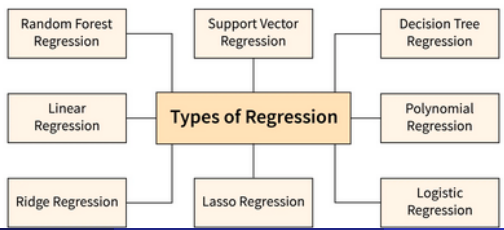
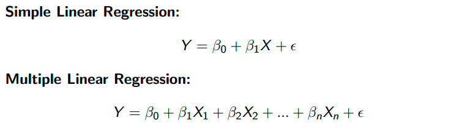
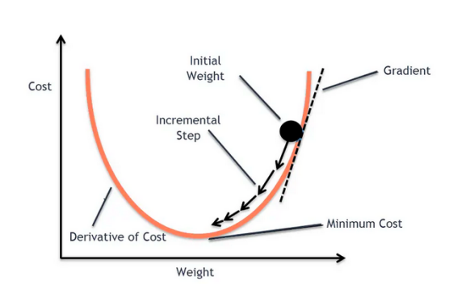
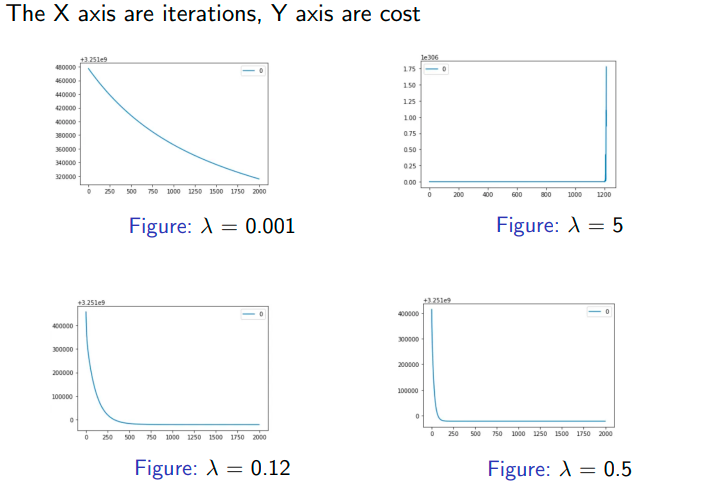
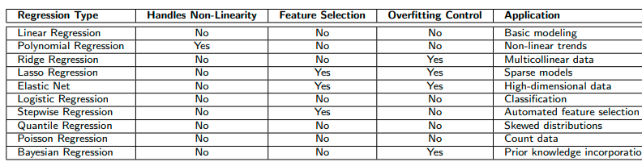
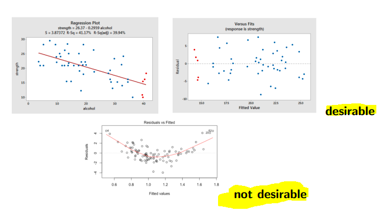

# Regression in Machine Learning


## Introduction to Regression


* **O que é regressão?**

* **Aplicações**

> ver slides, e a professora recomendou utilizar-la para verificar se as variáveis tem alguma relação linear

> Perceber a legenda da imagem e o que representa


## Types of Regression


> ver slides




## Linear Regression Formula




* ```Tarefa de aprendizagem```: 
    * encontrar o **vetor β** que **melhor se ajusta aos dados X** (variáveis ​​independentes) em **relação à variável dependente Y** (Targert variable)

* ```Nota```: 
    * na prática, **ϵ não faz parte do modelo aprendido**. 
    * A razão pela qual **incluímos ϵ na equação de regressão teórica é porque ele representa a parte de Y que não pode ser explicada pelo modelo** (em conjuntos de dados do mundo real, Y raramente é perfeitamente previsível a partir de X).


### Simplest: Least Squares Method (OLS)

> Ver slides e perceber 

### Non-linear regression

> ver slides e perceber


### Gradient Descent (GD) and Convergence




> Ver slides e perceber a figura e o algoritmo  (o que tenta fazer)


#### Derivation and Explanation

> NÃO INTERESSA ESTES SLIDES


### Why GD (Gradien Descent) and not OLS (Least Squares Method)?


> ver slides 


### Gradient Descent: role of λ, the learning rate

> ver slides e perceber o que é e como impacta gradient descent


#### Gradient Descent: λ example



> perceber o impacto de λ demonstrado nas figuras (qual é aquele que queremos, em níveis gráficos)

> Sabemos o o melhor λ por tentativa/erro (Hyperparameter tunning nos datasets de train e validation, nunca usamos o test. Tipicamente nunca aplicamos nada no test set)


## Regularization Techniques

* Por que usar regularização?

    * Ela evita o **overfitting** ao penalizar coeficientes grandes.

* Tipos
    > ver slides 

    > O λ representa o peso que vou aplicar aos coeficientes (não representa o learning rate aqui)


## Comparison 




> Uma comparação de modelos de regressão (não demos todos)


## Residual Analysis and Assumptions

* Assunções chave (quando aplicamos Linear regression):
    * Linearidade
    * Independência
    * Homocedasticidade
    * Normalidade dos resíduos
    * Ausência de multicolinearidade

> Se uma destas assunções for quebrada, a Linear regression não vai funcionar muito bem 

> Em slides mais a frente temos a explicação de cada uma das assunções acima  

### Residual Analysis


* O que são resíduos?

    * Resíduos são as diferenças entre os valores observados e os valores previstos.
    * Matematicamente, o resíduo para a observação i é: ei = Yi − Y'i.

* Por que analisar os resíduos?

    * Ajuda a validar as assunções do modelo.

    * Identifica padrões que indicam inadequações do modelo.

    * Garante a robustez das previsões.





> Ver explicação das imagens nos slides 


### Linearity

> ver slides 

### Independence of Residuals

> ver slides

### Homoscedasticity

> ver slides 

### Normality of Residuals

> ver slides 

### No Multicollinearity

> ver slides 

### Residuals

* A análise de resíduos é crucial para validar modelos de regressão.
* As assunções incluem linearidade, independência, homocedasticidade, normalidade e ausência de multicolinearidade.
* Testes estatísticos e visualizações ajudam a verificar essas premissas. 


## Model Evaluation Metrics

* Métricas comuns:
    * Mean Absolute Error (MAE)
    * Mean Squared Error (MSE)
    * Root Mean Squared Error (RMSE)
    * R-Squared (R²)

> Ver tabela que tem nos slides (por mais bonitinho)


## Model Interpretation

* Sinal e magnitude do coeficiente
* Valores de p para significância estatística 
    * ISTO É IMPORTANTE PARA QUALQUER MODELO DE ML
* R² ajustado para complexidade do modelo
* Fator de inflação da variância (VIF) para multicolinearidade


## Logistic Regression

* O que é Logistic Regression?

    * Um algoritmo de classificação usado para prever resultados binários ou multiclasse (realiza classificação multiclasse usando uma abordagem um-contra-todos).

    * Em vez de ajustar uma função linear, ele modela a probabilidade de um evento ocorrer.

* Aplicações:
    * Detecção de spam em e-mails.
    * Diagnóstico de doenças.
    * Previsão de rotatividade de clientes.


### Mathematical Formulation

> Ver slides e perceber 

> Podemos ajustar a decision boundary para o quer quisermos

Na sigmoid function transformamos dados continuos num intervalo entre [0,1] 

### Cost Function and Optimization

> Ver slides e perceber


### Regularization in Logistic Regression

> Ver slides e perceber 


### Evaluation Metrics 

> Ver slides e perceber (são vários slides e dividir sub-capitulos e ir buscar imagens que expliquem).

>para classificação binária de classes (mas pode ser generalizado para mais)

> Tipicamente focamos em minimizar os FN ou FP depende do caso (pedir llm um caso em que redução de um faz mais sentido, mas idealmente queremos minimizar os dois)


#### ROC example

> ver slides e perceber

#### ROC example: thresholding

> ver slides e perceber 

> Perceber para que serve esta análise 

## Multinomial Logistic Regression

> ver slides e perceber e para que serve 

### Example: 3-Class Softmax Regression

> ver exemplo 

### How Are Beta Terms Estimated?

> ver slides e perceber 

### Compute Logits

> passar a frente 

### Compute Softmax Probabilities

> ver exemplo

#### Interpretation

### Summary 


## Linear Regression: Example Setup

> ver vários slides com exemplos númericos 


## Other regression techniques used for Classification

* Linear Discriminant Analysis (LDA)
* Quadratic Discriminant Analysis (QDA)
* k-nearest neighbors (knn) (also used for regression)


### Linear Discriminant Analysis (LDA)

> Ver slides e perceber 


### Quadratic Discriminant Analysis (QDA)

> Ver slides e perceber


### k-Nearest Neighbors (k-NN)

> Ver slides e perceber 

#### The nearest neighbor approach

> Ver slides e perceber (especialmente em comparação com outras ténicas de regressão)


### Comparison (entre LDA,QDA,KNN e Logistic Regression)

> Passar a tabela para texto 

### When to Use Each


> ver slides 


## Bias and variance

> ver slides e perceber os conceitos ( a figura explica a ideia geral dos conceitos)


### Bias and variance decomposition

> Só para ter ideia como calcular a expected loss (não percissamos de saber a formula de baixo a de cima é a unica relevante)

> Bias (Bias²) : ver definição e fórmula (perceber o que é Bias e o que representa no modelo)


> Variance : ver definição e fórmula (perceber o que é Variance e o que representa no modelo )

> Noise:  ver definição e fórmula (perceber o que é Noise e o que representa no modelo )


### Some notes 

Low Bias, High Variance → Overfitting: The model memorizes
training data but generalizes poorly.
High Bias, Low Variance → Underfitting: The model is too simple
and fails to capture data patterns.
Noise is unavoidable and represents randomness in the data.
