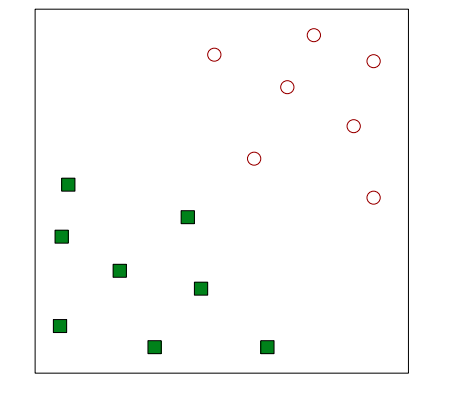
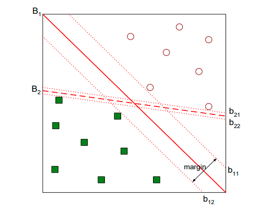
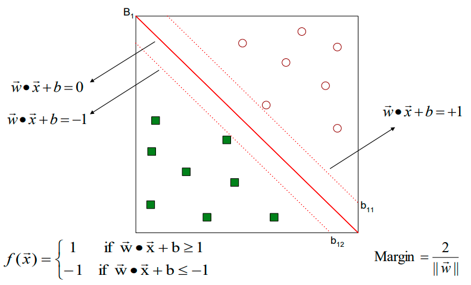
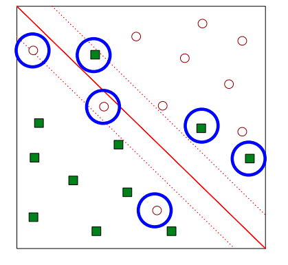

# SVM (Support Vector Machines) - Classification 

## Support Vector Machines (SVM)

> Pode lidar com Non-linear data (ao contrario de linear regression models (CONFIRMAR))

Encontre um hiperplano linear (decision boundary) que separe os dados (aqui não estamos a procura de uma linha mas sim de um hiperplano linear).

> Ver os diverso exemplos 

O que qeuremos é encontrar o hiperplano linear que máxima a margem (ver figura abaixo com exemplo de margem, e vemos que a linha B1 é a melhor opção porque máximiza a margem)

> CONFIRMAR (FUNCIONA BEM QUANDO QUEREMOS CLASSIFICAR DADOS ENTRE 2 CLASSES)

> Perceber o que as formulas e cada variavel representam no contexto de SVM (perceber o o que representam o -1, 1 e 0)

## Linear SVM 

> Ver slides e perceber 

### Learning Linear SVM

> Ver slides e perceber 

#### Example of Linear SVM

> Ver exemplo de Linear SVM (para problemas lineares SVM é parecido com Linear regression), perceber quais pontos são o support vector (são os pontos azul e vermelho mais perto de da linha)

### Learning Linear SVM (Cont.)

> Ver slides 

## Support Vector Machines

* E se o problema não for linearmente separável?

> Ver slides e perceber 

## Nonlinear Support Vector Machines
 
> ver slides e percebr 

### Learning Nonlinear SVM

> Não percissamos de saber detalhe (apenos os básicos)

> ver slides e perceber

### Example of Nonlinear SVM (ver slides)

> Ver figura 

### Learning Nonlinear SVM (Cont.)

> Ver slides e perceber 

## Characteristics of SVM
> Por isto numa tabela 

